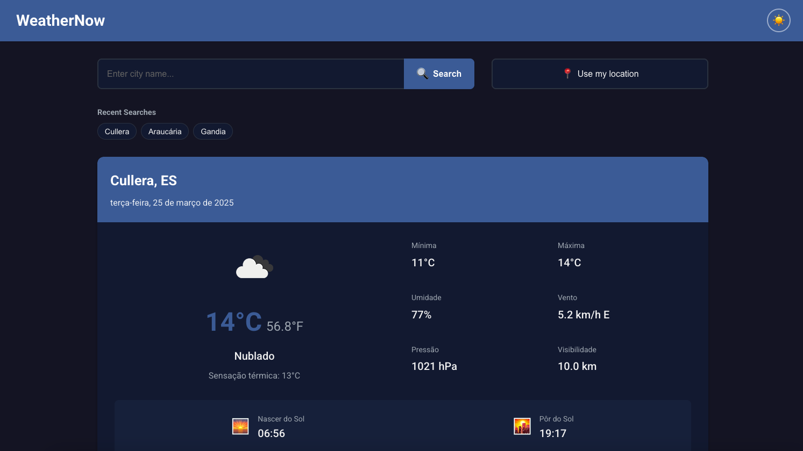

# 🌤️ WeatherNow - Modern Weather Forecast App

A sleek, user-friendly weather forecast application built with React that utilizes the OpenWeatherMap API to provide real-time weather information.



## ✨ Features

- 🔍 Search for weather forecasts by city name
- 🌡️ Display current temperature in both Celsius and Fahrenheit
- 💨 Show wind speed, humidity, and atmospheric pressure
- 🌅 Sunrise and sunset times
- 📊 Five-day weather forecast
- 🌈 Responsive design (works on mobile and desktop)
- 🎨 Light and dark theme support
- 📍 Option to use current location (requires user permission)

## 🛠️ Technologies Used

- **React**: JavaScript library for building the user interface
- **Context API**: Application state management
- **OpenWeatherMap API**: Weather data API
- **Axios**: HTTP client for API requests
- **CSS Modules**: Local scoped styling
- **Jest & React Testing Library**: Unit and integration testing
- **Netlify/Vercel**: Deployment and hosting

## 📋 Prerequisites

To run this project locally, you need to have installed:

- Node.js (v14.0.0 or higher)
- npm (v6.0.0 or higher) or yarn

## 🚀 Installation and Setup

1. Clone this repository:

```bash
git clone https://github.com/trzaskos/weather-now.git
cd weather-now
```

2. Install dependencies:

```bash
npm install
# or
yarn install
```

3. Create a `.env` file in the root directory and add your OpenWeatherMap API key:

```
REACT_APP_OPENWEATHER_API_KEY=your_api_key_here
```

4. Start the development server:

```bash
npm start
# or
yarn start
```

5. Access the app in your browser:

```
http://localhost:3000
```

## 📝 How to Get an API Key

1. Visit [OpenWeatherMap](https://openweathermap.org/) and create a free account
2. After logging in, go to the "API Keys" section
3. Generate a new API key
4. Copy the key and add it to your `.env` file as shown above

## 📊 Project Structure

```
weather-now/
├── public/
│   ├── index.html
│   ├── favicon.ico
│   └── ...
├── src/
│   ├── components/
│   │   ├── CurrentWeather/
│   │   ├── Forecast/
│   │   ├── Search/
│   │   └── ...
│   ├── context/
│   │   └── WeatherContext.js
│   ├── services/
│   │   └── api.js
│   ├── utils/
│   │   └── helpers.js
│   ├── App.js
│   └── index.js
├── .env
├── .gitignore
├── package.json
└── README.md
```

## 🧪 Tests

Run unit and integration tests:

```bash
npm test
# or
yarn test
```

## 📱 Responsiveness

The app is fully responsive and adapts to different screen sizes:

- Mobile devices (<768px)
- Tablets (768px - 1024px)
- Desktop (>1024px)

<!-- ## 🌐 Live Demo

Check out the live demo at: [https://weather-now-app.netlify.app](https://weather-now-app.netlify.app) -->

## 🤝 Contributing

Contributions are welcome! Feel free to open an issue or submit a pull request.

1. Fork the project
2. Create your feature branch (`git checkout -b feature/AmazingFeature`)
3. Commit your changes (`git commit -m 'Add some AmazingFeature'`)
4. Push to the branch (`git push origin feature/AmazingFeature`)
5. Open a Pull Request

## 📜 License

This project is licensed under the MIT License - see the LICENSE file for details.

## 📧 Contact

Maryele Trzaskos Gruber - [maryele.trzaskos@gmail.com](mailto:maryele.trzaskos@gmail.com)

Project Link: [https://github.com/trzaskos/weather-now](https://github.com/trzaskos/weather-now)

## ☕ Support

If you find this project helpful, consider buying me a coffee!

<p><a href="https://www.buymeacoffee.com/trzaskos"> </a></p>